<p align="center">
  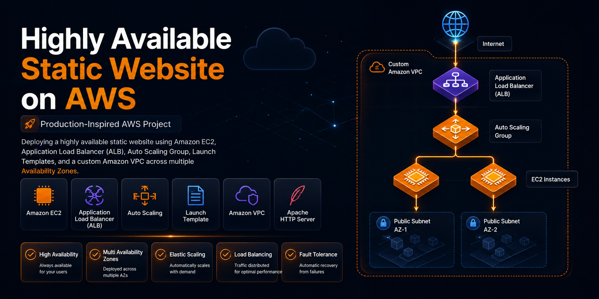
</p>

<h1 align="center">Highly Available Static Website on AWS using EC2, ALB & Auto Scaling</h1>

<p align="center">
Production-Inspired AWS Cloud Project demonstrating a highly available static website deployment using Amazon EC2, Application Load Balancer (ALB), Auto Scaling Group, Launch Templates, and a custom Amazon VPC.
</p>

<p align="center">


</p>

---

## 📖 Project Overview

This project demonstrates how to deploy a **highly available static website** on AWS by leveraging **Amazon EC2**, **Application Load Balancer (ALB)**, **Auto Scaling Group (ASG)**, **Launch Templates**, and a **custom Amazon VPC**.

A master EC2 instance was configured with the Apache HTTP Server and the website files. A custom Amazon Machine Image (AMI) was then created and used within a Launch Template. The Auto Scaling Group automatically launches identical EC2 instances across multiple Availability Zones, while the Application Load Balancer distributes incoming traffic and performs continuous health checks to ensure high availability.

This project simulates a production-inspired architecture capable of improving application availability, fault tolerance, and scalability while maintaining a consistent user experience.

# ✨ Key Features

- 🌐 Deployed a highly available static website on AWS.
- ⚖️ Distributed incoming traffic using an **Application Load Balancer (ALB)**.
- 📈 Automatically scaled EC2 instances with an **Auto Scaling Group (ASG)**.
- 🖥️ Created a reusable **Amazon Machine Image (AMI)** for consistent instance provisioning.
- 🚀 Used a **Launch Template** to standardize EC2 instance configuration.
- 🌍 Configured a **custom Amazon VPC** with two public subnets across multiple Availability Zones.
- 🔒 Implemented Security Groups to allow controlled HTTP and SSH access.
- ❤️ Enabled ALB health checks to route traffic only to healthy EC2 instances.
- 🔄 Demonstrated high availability by replacing failed instances through Auto Scaling.
- 📂 Hosted the static website using the **Apache HTTP Server**.

---

## ☁️ AWS Services Used

| AWS Service | Purpose |
|-------------|---------|
| **Amazon EC2** | Hosted the Apache web server and static website. |
| **Application Load Balancer (ALB)** | Distributed incoming traffic across multiple EC2 instances. |
| **Auto Scaling Group (ASG)** | Automatically maintained the desired number of EC2 instances. |
| **Launch Template** | Defined the EC2 launch configuration for Auto Scaling. |
| **Amazon Machine Image (AMI)** | Created a reusable image of the configured EC2 instance. |
| **Amazon VPC** | Provided an isolated networking environment for the infrastructure. |
| **Public Subnets** | Hosted internet-accessible EC2 instances in different Availability Zones. |
| **Internet Gateway** | Enabled internet connectivity for resources within the VPC. |
| **Route Table** | Routed internet-bound traffic through the Internet Gateway. |
| **Security Groups** | Controlled inbound HTTP and SSH access to EC2 instances. |
| **Target Group** | Registered healthy EC2 instances for the Application Load Balancer. |
| **Apache HTTP Server** | Served the static website content to end users. |

# 🏗️ Architecture Diagram

The following architecture illustrates how the static website is deployed in a highly available environment using Amazon EC2, Application Load Balancer (ALB), Auto Scaling Group, and a custom Amazon VPC.

<p align="center">
  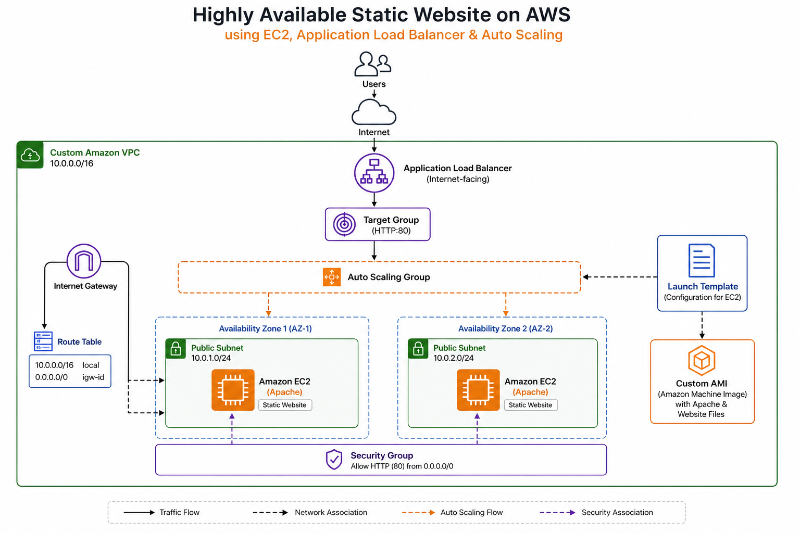
</p>

---

## 🔄 Deployment Workflow

The deployment follows a production-inspired workflow to ensure scalability, fault tolerance, and high availability.

```text
                    Internet
                        │
                        ▼
       Application Load Balancer (ALB)
                        │
                        ▼
                 Target Group
                        │
                        ▼
              Auto Scaling Group
                ┌───────────────┐
                │               │
                ▼               ▼
        EC2 Instance       EC2 Instance
          (Apache)           (Apache)
        Public Subnet 1    Public Subnet 2
                │               │
                └──────┬────────┘
                       ▼
                 Custom Amazon VPC
```

### Deployment Process

1. A custom Amazon VPC was created with two public subnets across different Availability Zones.

2. An Internet Gateway and Route Table were configured to provide internet connectivity.

3. A master Amazon EC2 instance was launched and configured with the Apache HTTP Server.

4. The static website files were deployed to the Apache web server and verified using the EC2 public IP address.

5. A custom Amazon Machine Image (AMI) was created from the configured EC2 instance.

6. A Launch Template was created using the custom AMI to standardize EC2 instance deployment.

7. An Auto Scaling Group was configured to automatically launch and maintain EC2 instances across multiple Availability Zones.

8. A Target Group was created to register EC2 instances and perform health checks.

9. An internet-facing Application Load Balancer (ALB) was associated with the Target Group to distribute incoming traffic.

10. The website was successfully accessed through the ALB DNS name, providing a highly available and fault-tolerant deployment.

## 📂 Repository Structure

```text
highly-available-static-website-aws-alb-autoscaling/
│
├── architecture/
│   └── architecture-diagram.png
│
├── assets/
│   └── banner.png
│
├── docs/
│   └── project-report.pdf
│
├── screenshots/
│   ├── 01-custom-vpc.jpg
│   ├── 02-public-subnet-az1.jpg
│   ├── 03-public-subnet-az2.jpg
│   ├── 04-internet-gateway.jpg
│   ├── 05-route-table.jpg
│   ├── 06-security-group.jpg
│   ├── 07-ec2-master-instance.jpg
│   ├── 08-custom-ami.jpg
│   ├── 09-launch-template.jpg
│   ├── 10-target-group.jpg
│   ├── 11-application-load-balancer.jpg
│   ├── 12-auto-scaling-group.jpg
│   ├── 13-running-instances.jpg
│   ├── 14-website-via-alb.jpg
│   ├── 15-instance-termination.jpg
│   └── 16-high-availability.jpg
│
├── website/
│   ├── index.html
│   ├── css/
│   ├── js/
│   ├── images/
│   └── ...
│
├── .gitignore
├── LICENSE
└── README.md
```

---

## 🏗️ Infrastructure Summary

| Component | Configuration |
|-----------|---------------|
| **Cloud Provider** | Amazon Web Services (AWS) |
| **Project Type** | Highly Available Static Website |
| **Web Server** | Apache HTTP Server |
| **Amazon VPC** | Custom VPC |
| **Availability Zones** | 2 |
| **Public Subnets** | 2 |
| **Internet Gateway** | 1 |
| **Route Table** | 1 |
| **Security Groups** | HTTP (80) and SSH (22) |
| **Amazon EC2** | Apache Web Server Instances |
| **Amazon Machine Image (AMI)** | Custom AMI |
| **Launch Template** | Custom Launch Template |
| **Auto Scaling Group** | Multi-AZ Deployment |
| **Application Load Balancer** | Internet-facing |
| **Target Group** | HTTP Health Checks Enabled |
| **Traffic Distribution** | Load Balanced Across EC2 Instances |
| **Scalability** | Automatic Instance Scaling |
| **High Availability** | Multi-AZ Architecture |
| **Website Type** | Static Website |

# 📸 Deployment Screenshots

The following screenshots capture the complete deployment process, from building the networking infrastructure to verifying high availability through the Application Load Balancer and Auto Scaling Group.

---

## 🌐 1. Network Infrastructure

<table>
<tr>
<td align="center">
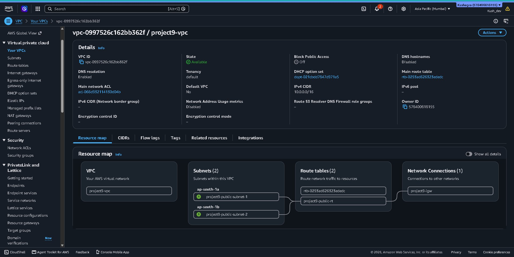<br>
<b>Custom Amazon VPC</b>
</td>

<td align="center">
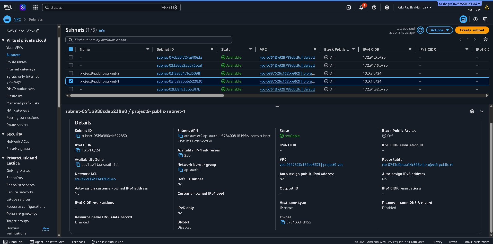<br>
<b>Public Subnet (Availability Zone 1)</b>
</td>
</tr>

<tr>
<td align="center">
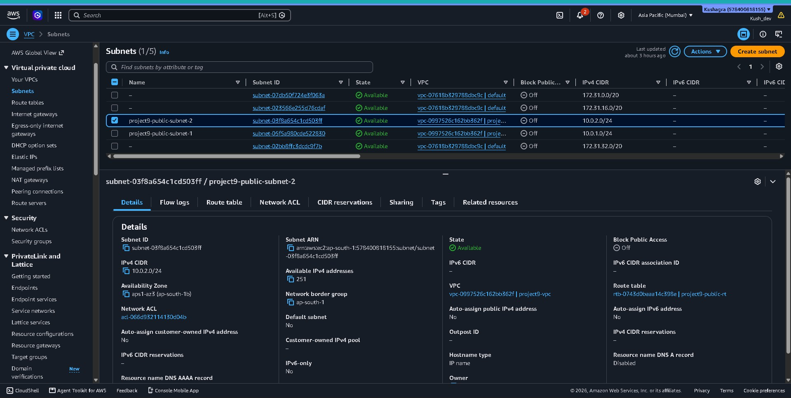<br>
<b>Public Subnet (Availability Zone 2)</b>
</td>

<td align="center">
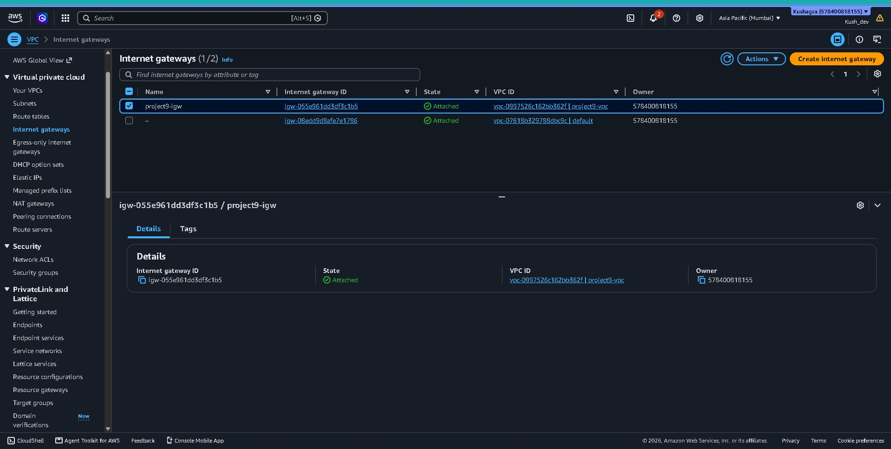<br>
<b>Internet Gateway Attached</b>
</td>
</tr>

<tr>
<td align="center">
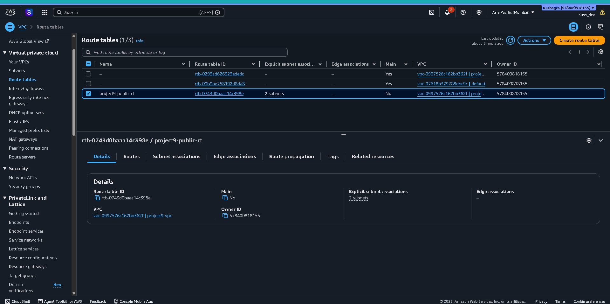<br>
<b>Route Table Configuration</b>
</td>

<td align="center">
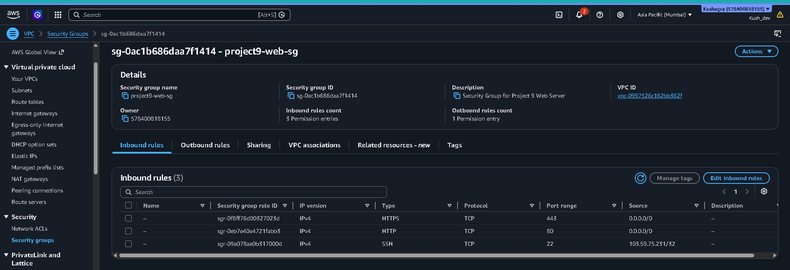<br>
<b>Security Group Configuration</b>
</td>
</tr>
</table>

---

## 🖥️ 2. EC2 & AMI Configuration

<table>
<tr>
<td align="center">
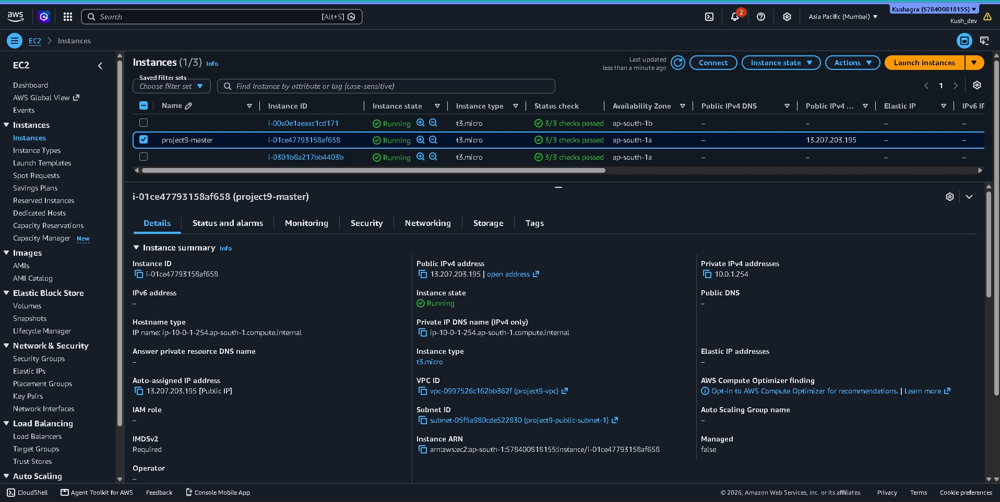<br>
<b>Master EC2 Instance</b>
</td>

<td align="center">
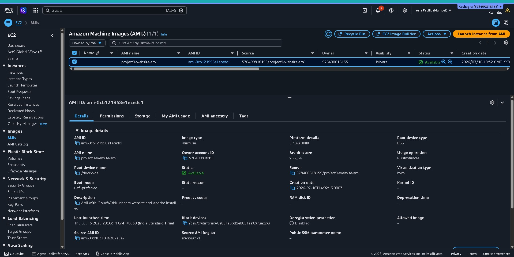<br>
<b>Custom Amazon Machine Image (AMI)</b>
</td>
</tr>

<tr>
<td align="center">
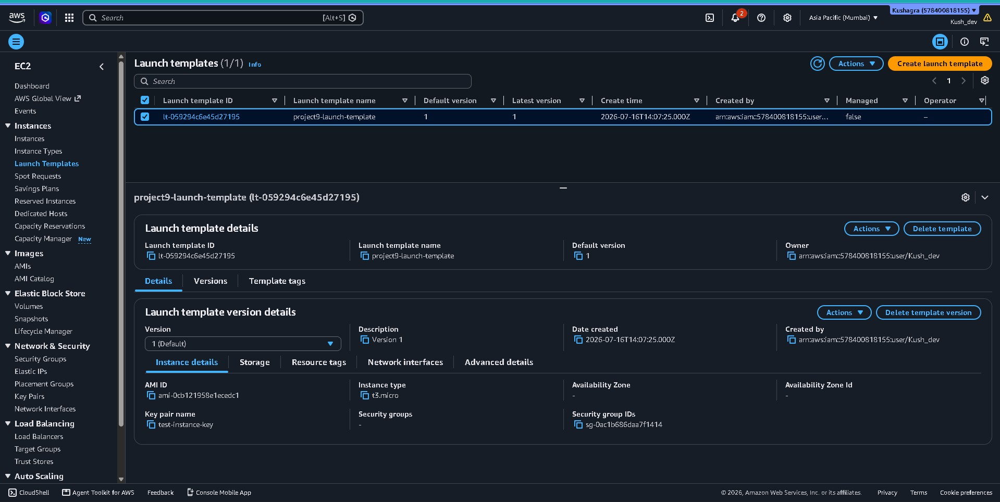<br>
<b>Launch Template</b>
</td>

<td align="center">
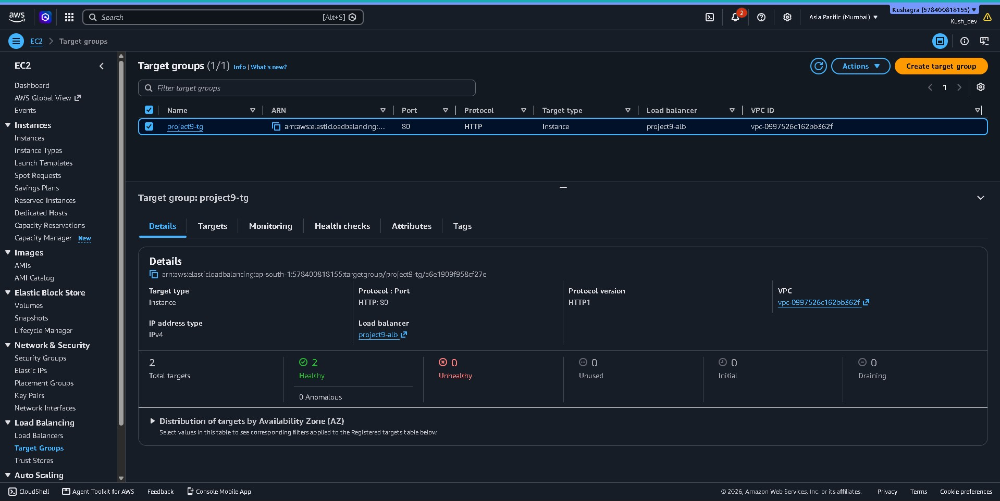<br>
<b>Target Group with Healthy Targets</b>
</td>
</tr>
</table>

---

## ⚖️ 3. Load Balancer & Auto Scaling

<table>
<tr>
<td align="center">
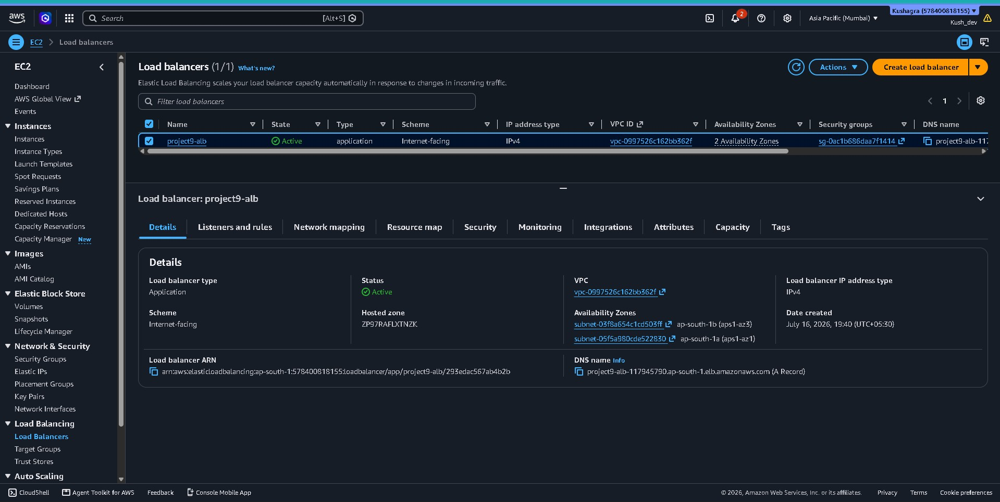<br>
<b>Application Load Balancer</b>
</td>

<td align="center">
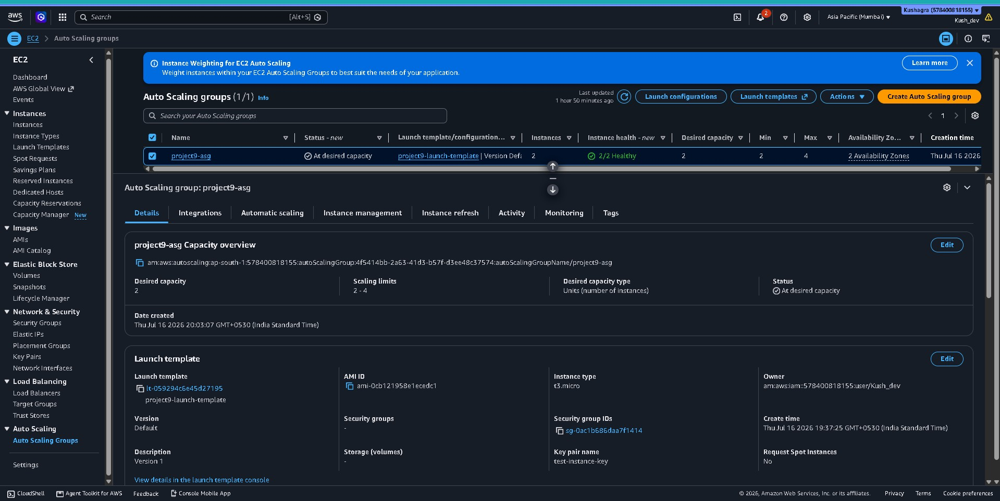<br>
<b>Auto Scaling Group</b>
</td>
</tr>

<tr>
<td align="center">
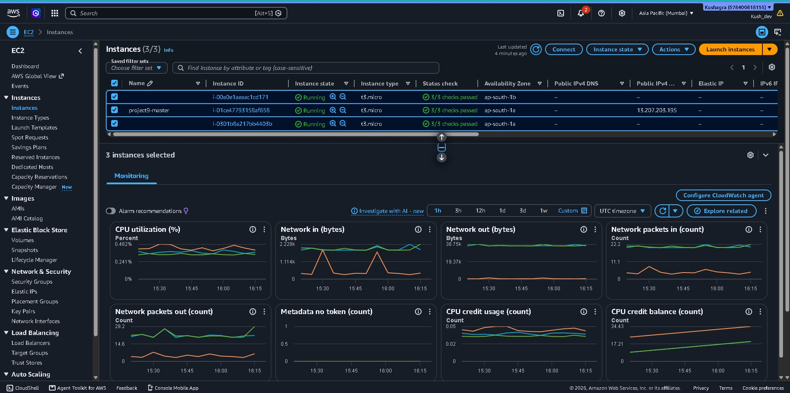<br>
<b>Running EC2 Instances</b>
</td>

<td align="center">
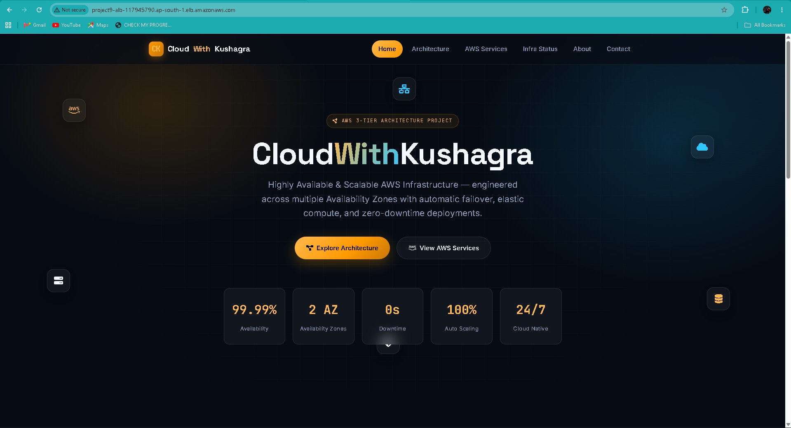<br>
<b>Website Accessed Through ALB</b>
</td>
</tr>
</table>

---

## 🚀 4. High Availability Validation

<table>
<tr>
<td align="center">
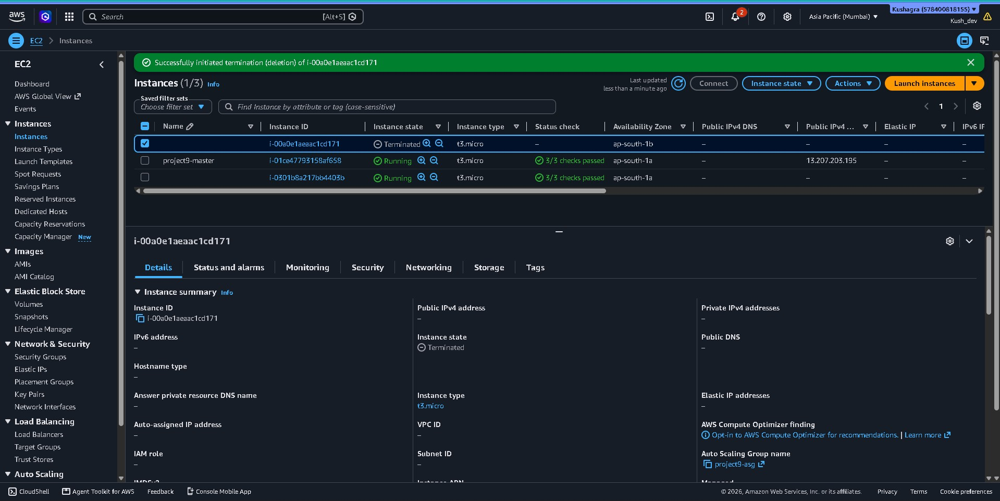<br>
<b>Instance Replacement by Auto Scaling</b>
</td>

<td align="center">
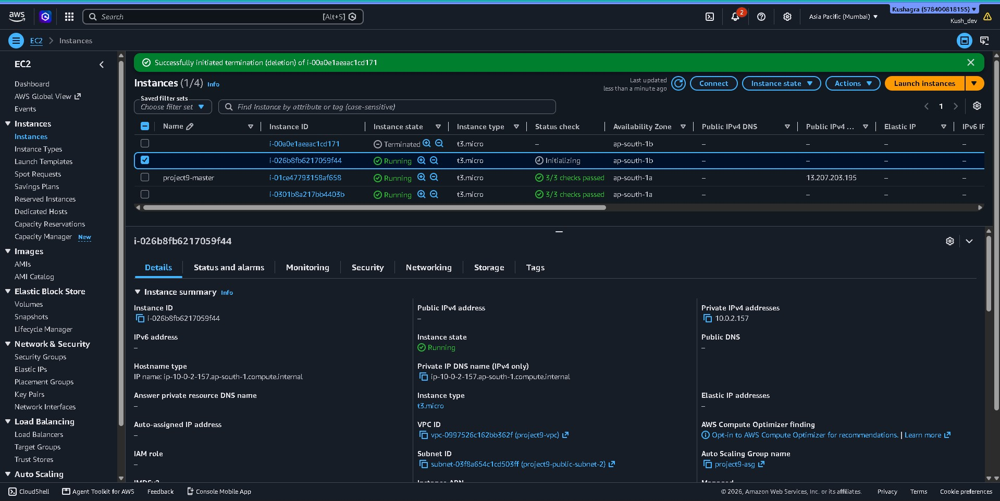<br>
<b>High Availability Successfully Achieved</b>
</td>
</tr>
</table>

## ⚠️ Challenges Faced

During the implementation of this project, several practical challenges were encountered:

- Configuring the **Application Load Balancer (ALB)** to correctly route traffic to healthy EC2 instances.
- Understanding the relationship between **Target Groups**, **Launch Templates**, and **Auto Scaling Groups**.
- Creating a reusable **Amazon Machine Image (AMI)** after configuring the Apache web server.
- Ensuring Security Group rules allowed the required HTTP and SSH traffic while maintaining secure access.
- Verifying that newly launched EC2 instances were automatically registered with the Target Group and served traffic through the ALB.
- Testing the high availability architecture by observing how Auto Scaling maintained the desired number of instances.

---

## 📚 Key Learnings

This project strengthened my understanding of several core AWS concepts:

- Designed a production-inspired highly available architecture using multiple Availability Zones.
- Learned how **Application Load Balancer (ALB)** distributes traffic across multiple EC2 instances.
- Understood how **Auto Scaling Groups** automatically maintain application availability.
- Gained hands-on experience creating and using **Amazon Machine Images (AMIs)**.
- Learned to standardize EC2 deployments using **Launch Templates**.
- Improved understanding of AWS networking components including **Amazon VPC**, **Public Subnets**, **Route Tables**, **Internet Gateway**, and **Security Groups**.
- Understood the importance of health checks for maintaining application availability.
- Practiced organizing AWS resources using a structured and production-inspired deployment workflow.

---

## 🚀 Future Improvements

Potential enhancements that could further improve this project include:

- Deploy the website using a private subnet architecture with a NAT Gateway for enhanced security.
- Replace the static website with a dynamic web application backed by Amazon RDS.
- Store static assets in Amazon S3 and distribute them using Amazon CloudFront.
- Automate infrastructure provisioning using **AWS CloudFormation** or **Terraform**.
- Configure HTTPS using AWS Certificate Manager (ACM) and an HTTPS listener on the Application Load Balancer.
- Implement monitoring and alerting with Amazon CloudWatch.
- Integrate a CI/CD pipeline using GitHub Actions and AWS deployment services.
- Deploy the application using Infrastructure as Code (IaC) to improve repeatability and scalability.

---

## 👨‍💻 Author

**Kushagra Sharma**

B.Tech Computer Science Engineering Student | AWS Cloud & DevOps Enthusiast

I enjoy building production-inspired cloud projects to strengthen my understanding of AWS architecture, DevOps practices, and scalable infrastructure.

### 📬 Connect with Me

- **GitHub:** https://github.com/KushagraSharma22
- **LinkedIn:** https://linkedin.com/in/kushagra-sharma-416877289

---

## 📄 License

This project is licensed under the **MIT License**.

See the [LICENSE](LICENSE) file for more information.

---

<div align="center">

### ⭐ If you found this project helpful, consider giving it a star!

Thank you for visiting this repository.

</div>
